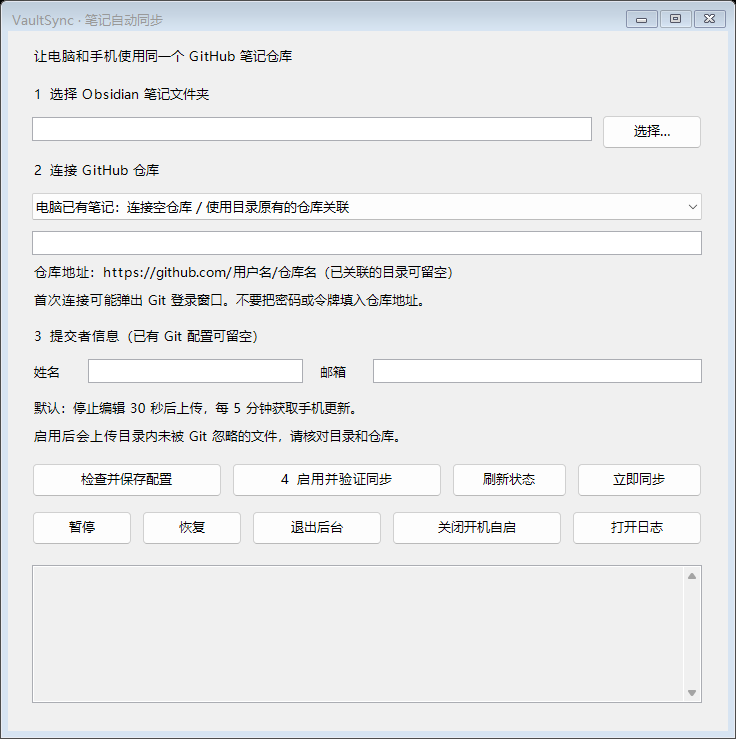

# Obsidian Mobile Companion

让电脑和安卓手机通过你自己的 GitHub 仓库同步 Markdown 笔记。电脑端自动同步，手机端阅读、缓存与编辑。

## 下载与上手

| 你要安装什么 | 下载 | 使用要求 |
|---|---|---|
| **Windows 轻量版 · 本机已有 Node.js 和 Git** | [下载轻量包](https://github.com/zhdmm35/obsidian-mobile-companion/releases/download/vaultsync-v0.2.0/VaultSync-v0.2.0-windows-light.zip) | 使用 PATH 中的 Node.js 20+ 和 Git；已包含工具依赖，无需 npm install |
| **Windows 笔记自动同步工具 · VaultSync v0.2.0 正式版** | [下载 Windows x64 便携包](https://github.com/zhdmm35/obsidian-mobile-companion/releases/download/vaultsync-v0.2.0/VaultSync-v0.2.0-windows-x64.zip) · [版本说明](https://github.com/zhdmm35/obsidian-mobile-companion/releases/tag/vaultsync-v0.2.0) | 内含 Node.js、Git，无需另装运行环境；需要自己的 GitHub 仓库 |
| **Android 笔记应用 · v0.1.1 候选版** | [下载签名 APK](https://github.com/zhdmm35/obsidian-mobile-companion/releases/download/v0.1.1/obsidian-mobile-companion-v0.1.1.apk) | Android 8.0+；需要 GitHub 仓库和读写令牌；仍为预发布 |

Windows：**解压 → 双击 `VaultSync.vbs` → 选择笔记目录、填写仓库地址 → 检查配置并启用同步**。无需打开终端或编辑 JSON。便携包约 208 MB，首次连接可能需要完成 GitHub 登录。

本机已安装 Node.js 和 Git，选轻量包即可，不需要再下载运行环境；尚未安装或不确定，选完整便携包。两种包的操作相同，启动时会检查能否找到 Node.js 和 Git，缺失时提示使用完整包。



已有本地笔记请连接空仓库；从 GitHub 下载已有笔记请选空文件夹。两边都有内容时工具会停止并提示。启用后会上传未被 Git 忽略的文件，请先核对目录。冲突需要手动处理，当前不支持自动创建 GitHub 仓库。详细步骤见 [桌面工具使用说明](tools/vaultsync/README.md)。

适合已经使用 GitHub 存放笔记、希望电脑自动同步和手机阅读编辑的人。首次使用 GitHub 的用户仍需准备仓库；安卓端仍需创建访问令牌。


An independent Android companion app for Markdown vaults stored in GitHub repositories. Browse and search your notes, render common Obsidian syntax, read cached notes offline, and edit existing notes with explicit conflict handling. Ships with `tools/vaultsync`, a small desktop daemon that keeps a PC-side vault directory in sync with the same GitHub repository.

一个独立的 Android 应用，用于浏览和编辑托管在 GitHub 仓库中的 Markdown 知识库。支持浏览与搜索笔记、渲染 Obsidian 常用语法、离线阅读已缓存笔记、编辑保存并显式处理冲突。另附 PC 端 `tools/vaultsync` 小工具，可将本地 Vault 目录与同一个 GitHub 仓库保持同步。

> **Status / 状态:** Windows VaultSync v0.2.0 已正式发布，提供含运行环境的便携包；Android v0.1.1 仍为预发布候选，提供签名 APK 供试用。本次桌面版发布不包含新的 Android APK。This project is not affiliated with or endorsed by Obsidian.md. 本项目与 Obsidian.md 无任何关联或背书关系。

## Project positioning / 项目定位

This project is a GitHub Markdown knowledge-base mobile workflow, not only an Obsidian reader. It connects four pieces into one auditable loop:

- mobile offline reading for cached notes;
- safe editing with explicit remote-conflict review;
- rendering for WikiLinks, callouts, tables, task lists, frontmatter, and embeds;
- two-way synchronization between a phone and a PC vault through GitHub and `tools/vaultsync`.

它解决的是 GitHub Markdown 知识库的移动端离线阅读、冲突安全编辑、WikiLink/Callout 渲染，以及 PC 与手机之间的双向同步问题，而不只是“又一个 Obsidian Android 客户端”。

---

## Features / 功能

**Android app / 安卓应用**

- Connect to any GitHub repository with a fine-grained personal access token; browse files and folders, search note names and the content of notes you have opened, and keep favorites and recent notes.
  使用 fine-grained 个人访问令牌连接任意 GitHub 仓库；浏览文件与文件夹、按笔记名与已打开笔记的正文搜索、收藏与最近打开。
- Render Markdown tables, task lists, Obsidian WikiLinks, callouts, frontmatter, and embedded images/notes (unsupported syntax degrades gracefully to plain text).
  渲染 Markdown 表格、任务列表、Obsidian WikiLink、Callout、Frontmatter 以及图片/笔记嵌入（暂不支持的语法会降级为原文显示，不会报错）。
- View vault images full-screen: tap an image in the file browser or inside a note, pinch or double-tap to zoom, and swipe to browse other images in the same folder. Works offline for cached images.
  图片全屏查看：在文件浏览页或笔记中点击图片打开，支持双指/双击缩放与拖动，左右滑动浏览同目录图片；已缓存图片离线可看。
- Read previously cached notes offline; uncached content requires a network connection.
  已缓存的笔记可离线阅读；未缓存内容需要联网。
- Edit existing Markdown notes and save them to GitHub. If the remote note changed while you were editing, the app shows both versions and lets you review before resolving the conflict — no silent overwrite.
  编辑已有 Markdown 笔记并保存回 GitHub。如果编辑期间远端被改动，应用会并列展示两个版本供你确认，绝不静默覆盖。
- Share a note's Markdown source to any app from the reader menu.
  在阅读页菜单把笔记的 Markdown 原文分享给其他应用。
- Automatic refresh with a freshness window, foreground and network-recovery triggers; background fetches are deduplicated.
  支持自动刷新（新鲜度窗口 + 前台与网络恢复触发），后台请求自动去重。

**Desktop helper (`tools/vaultsync`) / PC 端同步工具**

- Watches one local vault directory and automatically commits and pushes changes (30 s debounce).
  监听本地 Vault 目录，文件变化后自动提交并推送（30 秒防抖）。
- Periodically fetches and rebases remote changes (every 5 min by default), so edits made on the phone arrive on the PC.
  定时拉取远端改动并 rebase（默认每 5 分钟），手机上的编辑会同步回电脑。
- Rebase conflicts abort safely and keep both sides; network failures are logged and retried on the next cycle.
  冲突时安全中止、双方内容都保留；网络失败只记日志，下个周期自动重试。
- Optional Windows autostart via the Startup folder (see `tools/vaultsync/README.md`).
  支持通过「启动」文件夹实现 Windows 开机自启（见 `tools/vaultsync/README.md`）。
- Guided Windows setup, real sync results, pause/resume, and a portable package with bundled runtimes; a CLI uses the same configuration checks.
  Windows 图形向导支持目录选择、配置检查、真实同步结果、暂停与恢复；便携包自带运行环境，CLI 复用相同配置检查。

## How it works / 工作原理

```
┌────────────┐   GitHub REST API   ┌──────────────────┐   git push/fetch   ┌─────────────┐
│ Android app│ ◄─────────────────► │ GitHub repository│ ◄────────────────► │ PC vaultsync │
└────────────┘                     └──────────────────┘                    └─────────────┘
```

- The app talks to the GitHub REST API directly; there is no app-owned backend service and no account server. Note content is read from and written to the repository you choose.
  应用直连 GitHub REST API，没有自建后端服务，也没有账号服务器。笔记内容只读写你指定的仓库。
- vaultsync runs plain `git` commands (`status → add → commit → fetch → rebase → push`) against the configured vault. Setup can connect local notes to an empty repository or clone remote notes into an empty folder.
  vaultsync 对配置目录执行普通 git 命令；向导可将本地笔记连接到空仓库，或把远端笔记克隆到空文件夹。

## Build and test / 构建与测试

Requirements / 环境要求：Android SDK 35, JDK 17。The app supports Android 8.0 (API 26) and newer. 应用最低支持 Android 8.0（API 26）。

```powershell
# Debug build / 构建 debug 包
./gradlew.bat assembleDebug

# Unit tests / 单元测试
./gradlew.bat testDebugUnitTest

# Instrumented tests (needs a running emulator or device) / 仪器化测试（需模拟器或真机）
./gradlew.bat connectedDebugAndroidTest
```

For desktop source development, install Node.js and Git. End users can use the portable download above / 桌面源码开发需要 Node.js 和 Git；普通用户请使用顶部便携包：

```powershell
cd tools/vaultsync
npm ci
npm test
npm run setup
```

`vaultsync.config.json` is machine-specific and is ignored by Git. Review the configured vault and remote before starting the helper: it automatically commits and pushes local changes.

`vaultsync.config.json` 是本机配置，已被 Git 忽略。启动前请核对 Vault 路径和远端仓库：它会自动提交并推送本地改动。

## Setup / 使用配置

**Android app / 应用侧**

1. Create a fine-grained personal access token at GitHub → Settings → Developer settings, restricted to the repository you want to access, with the minimum permissions your workflow needs (contents read/write).
   在 GitHub → Settings → Developer settings 创建 fine-grained 令牌，限定到目标仓库，按需授予最小权限（contents 读写）。
2. Install the APK, enter the token and repository, and start browsing.
   安装 APK，填入令牌和仓库地址即可使用。
3. Revoke the token in GitHub if you no longer use the app.
   不再使用时请在 GitHub 吊销令牌。

**PC sync / PC 同步侧**

See `tools/vaultsync/README.md` for configuration, logs, Windows autostart, and troubleshooting.

配置、日志、Windows 开机自启与排查方法见 `tools/vaultsync/README.md`。

## Data and credentials / 数据与凭据

- The GitHub token is encrypted with AES-GCM using a key held by Android Keystore; the app never puts the token in its Room database, DataStore, or logs.
  令牌使用 Android Keystore 持有的密钥以 AES-GCM 加密存储，不会进入 Room 数据库、DataStore 或日志。
- Cached note content and app metadata are stored locally on the device.
  笔记缓存和应用元数据只存在设备本地。
- vaultsync runs local git commands and can commit and push automatically — use it only with a repository whose contents and remote you control.
  vaultsync 执行本地 git 命令、会自动提交推送——只用于你能掌控内容与远端的仓库。

## Contributing / 参与贡献

See [CONTRIBUTING.md](CONTRIBUTING.md) for local checks and pull request guidance. Please use synthetic notes in tests and never include personal vault content, access tokens, or private screenshots in issues or pull requests.

本地检查与 PR 规范见 [CONTRIBUTING.md](CONTRIBUTING.md)。测试请使用虚构笔记；不要在 issue 或 PR 中包含个人知识库内容、访问令牌或隐私截图。

## Maintainer workflow / 维护流程

The repository uses Codex as an auditable maintenance assistant for issue triage, test generation, pull-request checks, and changelog drafts. The human maintainer reviews every result, decides what is accepted, and performs the final merge and release. Codex is given public repository metadata and synthetic fixtures only; private vault content and access tokens are never used as prompt data.

GitHub Actions runs the Android unit tests and debug APK build, plus the `tools/vaultsync` test suite, on every pull request and push to `main`. See [`.github/workflows/ci.yml`](.github/workflows/ci.yml), the [issue templates](.github/ISSUE_TEMPLATE/), [pull-request template](.github/pull_request_template.md), [security policy](SECURITY.md), and [ROADMAP.md].

仓库把 Codex 用作可审计的维护助手：进行 Issue 分诊、测试生成、PR 检查和 changelog 草稿；每项结果都由人工维护者复核，最终合并和发布由维护者本人决定。Codex 只接触公开仓库元数据和虚构测试数据，不使用私人 Vault 内容或访问令牌。GitHub Actions 会在每个 PR 和 `main` 分支推送时运行 Android 单测、debug APK 构建以及 `tools/vaultsync` 测试。

## Beta testing / 试用反馈

Install the signed APK from the [v0.1.1 Release](https://github.com/zhdmm35/obsidian-mobile-companion/releases/tag/v0.1.1), then test the complete loop with a repository you control: read cached notes offline, edit a note, create a deliberate remote conflict, render WikiLinks/callouts, and sync changes between the phone and `tools/vaultsync`. Use the [beta feedback issue form](.github/ISSUE_TEMPLATE/beta_feedback.yml) for results. Please report the device, Android version, app version, scenario, result, and sanitized logs; never include access tokens or private vault content.

请真实试用 v0.1.1：在你能控制的 GitHub 仓库中测试离线阅读、编辑、远端冲突处理、WikiLink/Callout 渲染，以及手机与 `tools/vaultsync` 的双向同步。反馈请使用 [试用反馈 Issue 表单](.github/ISSUE_TEMPLATE/beta_feedback.yml)，填写设备、Android 版本、应用版本、测试场景、结果和脱敏日志，不要提交访问令牌或私人 Vault 内容。下载量、测试人数、关闭 Issue 数和修复项只按 GitHub Release 与真实反馈记录统计。

## License / 许可证

This project is licensed under the MIT License. See [LICENSE](LICENSE).

本项目以 MIT 许可证发布，详见 [LICENSE](LICENSE)。
